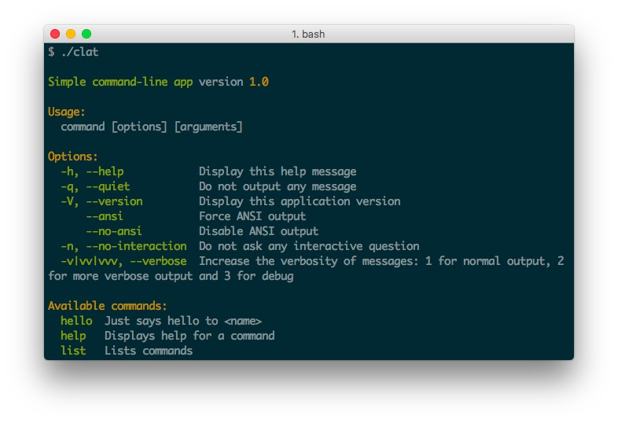

# Simple command-line app

Simple command-line app template.

## Usage

```
./clat hello <your-name>
```

## Global install (mac)

If you want to use this command from anywhere on your mac, you can add the following row into your .bash_profile

```
alias clat=~/path/to/your/command-line-app-template/clat
```

<br>



