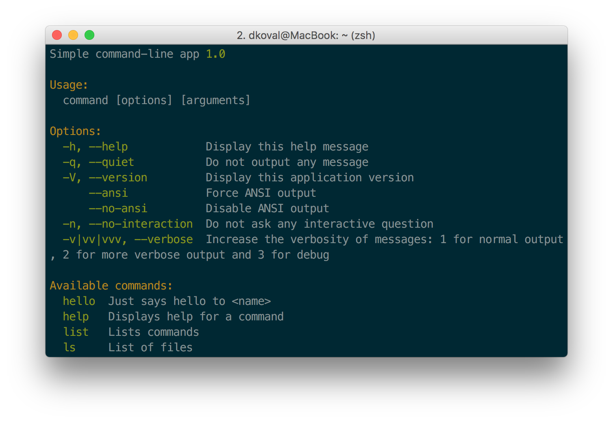

# Simple command-line app

Simple command-line app template.

## Installation

#### Globally
```
composer global require dkoval/clat
```
This way you will be able to use this utility from anywhere.
#### Locally
```
composer require dkoval/clat
```

## Usage

```
clat ls
```

<br>



